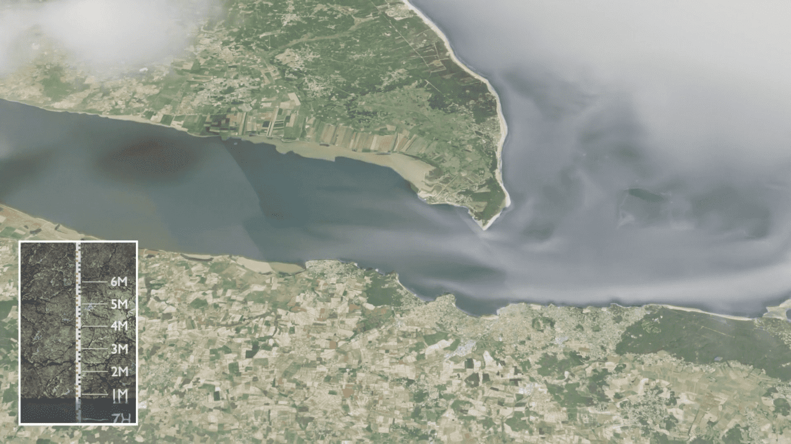
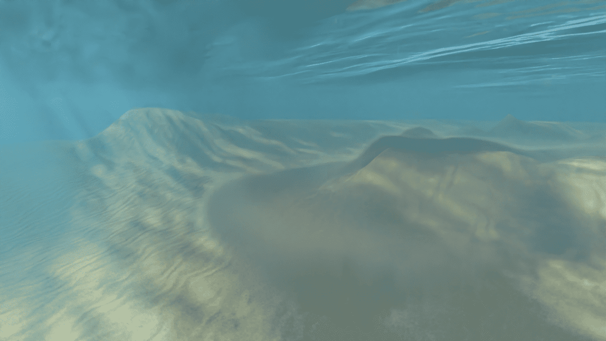
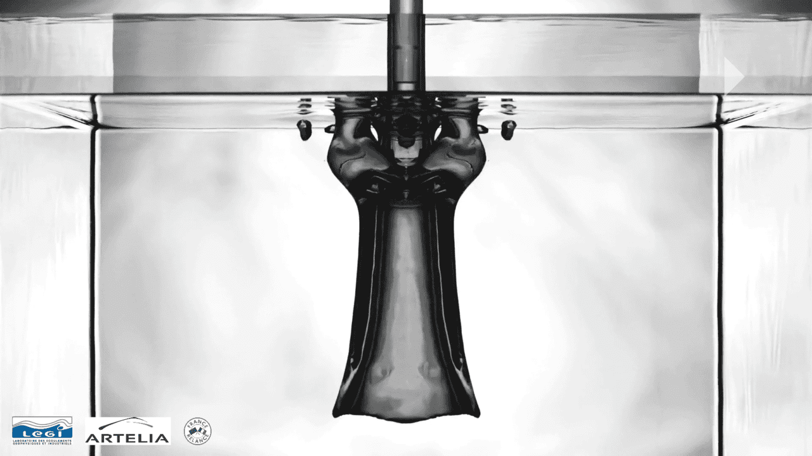

# Summary

The task to communicate and show results from fluid dynamics simulations to non-specialist audiences is sometimes
problematic. These audiences may not fully understand common graphical outputs generated through scientific
visualization tools which are often based on a variety of color palettes. Therefore, a Blender [@blender] add-on,
`NIMPHS`, is developed. This add-on aims to ease the process of creating interesting 3D renderings of fluid
simulations. This tool provides features to import, manipulate and post-process data from such simulations through
the Blender rendering pipeline in order to leverage the power of its renderers: Eevee and Cycles. Some examples are
shown in Figure 1 and Figure 2.

The add-on is developed using open source tools from ARTELIA, and `pyvista` [@pyvista], a high-level python API for
`VTK` [@vtk]. It also makes use of another Blender add-on: `Stop-Motion-OBJ` [@stop-motion-obj] to ease the creation
of animations. `NIMPHS` tries to unify the way data are manipulated among the different file formats it supports.
Indeed, data structures often present similarities in their topologies in CFD (Computational Fluid Dynamics), so it is
possible to have shared features.

Fast and memory efficient algorithms to manipulate data using python in Blender are implemented. For that, `numpy`
[@numpy] is used to fasten data manipulation. When it comes to specific rendering tasks, such as volumes, the
`multiprocessing` module, `numba` [@numba] and `pyopenvdb` [@openvdb] are used to generate volume sequences in a
reasonable amount of time.

# Statement of need

The process of modeling fluid flows is often divided into three main steps: pre-processing, simulation and
post-processing. The first one consists in choosing the right equations and the extent of the model in order
to represent the physical phenomena which will be of interest. Since these equations are only solved for a finite
number of points in space, there is a need to discretize the modeled space into a mesh. Then, the simulation step makes
use of fluid dynamics solvers such as `OpenFOAM` [@openfoam] and `TELEMAC-MASCARET` [@telemac-mascaret] to solve the
previously chosen equations. Finally comes the step of post-processing generated data in order to visualize the
evolution of physical phenomena through time and space.

Post-processing data in the field of computational fluid dynamics is an important part of the modeling process.
Engineers and researchers need visualizations to understand, validate and fix the results of their simulations in
comparison to real world observations and laboratory experiments. There are several tools at our disposal to generate
graphical outputs of such models. We can quote: ParaView [@paraview], QGIS [@qgis], Fudaa [@fudaa] or Tecplot
[@tecplot]. These powerful software are commonly used by scientists to provide outputs in order to analyze them and
then take diverse decisions or communicate their results.

However, when it comes to non-specialist audiences these graphical outputs can be very difficult to understand.
Scientific visualizations are often minimalist and only represent specific data, which often does not offer the best
keys to understand the results. Thus, one idea is to generate photo-realistic renderings of these data in order to
produce better visuals for these audiences. Such graphical outputs could ease the understanding of physical phenomena
which take place in fluid simulations.

Some of the previously quoted tools try to tackle this issue by providing photo-realistic 3D renderers (e.g., intel
`OSPRay` [@ospray] in ParaView). However, it is often difficult to add visually convincing scenes and contexts to
significantly better these graphical outputs. Therefore, the tool `NIMPHS` is designed to be used for such
applications. It is an add-on for Blender, the free and open source 3D creation suite.

# Outlook and use cases

The tool `NIMPHS` was first designed to post-process hydraulic simulations. However CFD tools can tackle a much larger
set of problematics. Thus, `NIMPHS` can also manage non-hydraulic simulations (see Figure 3 for example). Morevover,
the add-on is designed to ease the support and implementation of other file formats which have close similarities with
`foam` (`OpenFOAM`) and `Serafin` (`TELEMAC-MASCARET`) file formats (which are already supported).

The examples shown in Figure 1, Figure 2 and Figure 3 are all attempts of photo-realistic renderings of fluid
simulations. However, since Blender is a 3D creation suite, even more creative renderings can be achevied. In
particular, we can quote the visual scripting tool `geometry nodes` available since Blender 2.92 to help in this task.

# Acknowledgements

This project has been funded by ARTELIA as part of Félix Olart's internship at ARTELIA.

# Figures

{width=75%}

{width=75%}

{width=75%}

# References
